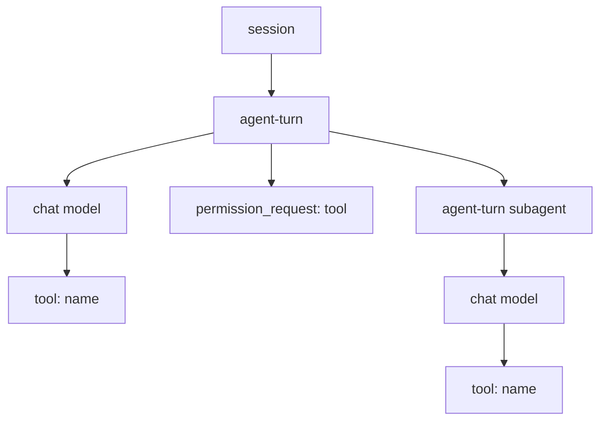

thirdeye is local-first, but it can optionally mirror each captured Claude Code, Codex, or Cursor session to [Pydantic Logfire](https://pydantic.dev/logfire). Export is live once enabled; there is no separate batch-export step.

## Enable export

If you installed thirdeye with Homebrew, Logfire support is already included:

```bash
thirdeye logfire enable
thirdeye logfire status
```

For a Python installation, install the optional dependency first:

```bash
pip install 'thrdi[logfire]'
thirdeye logfire enable
thirdeye logfire status
```

`thirdeye logfire enable` signs you in through the browser and mints the write token for you — there is no key to find and paste. If a token is already saved, the command offers to reuse it. Otherwise it runs Logfire's browser login, then uses your writable project, prompting you to choose when the account has more than one. If no writable projects are listed, it offers to create or attach one in your organization.

To sign in as a different account, or when a saved login has expired:

```bash
thirdeye logfire enable --auth
```

`--auth` logs out of Logfire first so the browser flow starts fresh, then mints a new token.

The token never reaches your shell history or process arguments: it is not accepted as a command-line option, and the browser flow never places it on the command line. The interactive `thirdeye setup` wizard uses the same browser sign-in. Where browser login cannot run — a remote shell with no browser, for example — paste the write token on the **Settings** page in `thirdeye ui`, where the field is labeled *Gateway key*. Every path persists the same settings in `~/.thirdeye/config.yaml`, and the write token selects the Logfire destination.

To stop exporting while keeping the saved token:

```bash
thirdeye logfire disable
```

## Query and visualize your traces

Logfire export is only the first half of the workflow. Connect your coding agent to Logfire's hosted MCP server to ask questions about captured sessions or maintain dashboards without copying telemetry into the prompt by hand:

- **[Query Logfire with MCP](/docs/logfire-mcp)** — connect Claude Code, Codex, or Cursor and investigate sessions with natural-language questions backed by SQL.
- **[Build coding-agent dashboards](/docs/logfire-dashboards)** — turn validated MCP queries into reusable Logfire dashboards for cost, throughput, outcomes, and tool behavior.

The Logfire write token saved by thirdeye and the MCP connection are separate credentials. MCP normally uses browser OAuth; never reuse the saved write token as an MCP credential.

## Trace shape

Each thirdeye session becomes one Logfire trace, searchable by `gen_ai.conversation.id` and separated by `claude`, `codex`, or `cursor` service name.



- `session` is a stable root shared by turns exported from separate hook processes.
- `agent-turn` spans carry the user prompt, final response, turn status, and real timestamps.
- `chat <model>` spans carry OpenTelemetry GenAI message, provider, model, and token-usage attributes.
- Tool spans nest under the specific model call that requested them, with paired start/end times.
- Permission requests sit directly under their turn as point-in-time spans.
- Subagent turns nest recursively and preserve their own model and tool-call trees.

Claude Code can produce multiple model-call spans within one turn. Codex reconstructs its model calls and tool children from the completed rollout, deduplicating cumulative token reports before calculating usage. Cursor reconstructs generations from IDE or CLI hooks, pairing shell and MCP callbacks while recording file operations, generic tools, and completed subagents.

Subagents dispatched in Cursor IDE and CLI sessions are exported beneath their dispatching `Task` span, including background, parallel, and nested children. Each child's tool calls are attributed to it by the child hook generation derived from its `Task` call identity — never by timing, nearest-turn heuristics, or tool-completion order.

Each turn's `invoke_agent` span is named for the platform and the model it ran on, such as `claude-code[claude-opus-4-5]`. Logfire's Agents page groups solely on `gen_ai.agent.name`, so a bare platform name collapsed every model a CLI ever ran into one agent; qualifying the name registers each model as its own agent while the platform stays a shared prefix. A turn is attributed to the model it called most, ties going to the earliest call, so a small-model side call inside a large-model turn cannot relabel the whole invocation. Turns that record no calls fall back to the model in their attributes. Codex subagents stay unqualified, because their hook payload carries no model.

## Runtime behavior

The hook never waits for Logfire. It writes a small local job and starts a detached worker, which builds and flushes the span tree in the background. A slow or unreachable endpoint therefore does not add network latency to agent tool calls.

Each turn is claimed atomically so duplicate or replayed hooks do not export the same tree twice. Failed exports release the claim so a later retry can recover. Logfire errors are written to thirdeye's capture error log and are never emitted as hook output.

## Privacy and scrubbing

Enabling Logfire sends captured prompts, responses, tool inputs/results, and span attributes to the Logfire project associated with the saved write token. Leave it disabled if traces must remain exclusively local.

Logfire's default secret scrubbing remains active. thirdeye exempts only the default match for the literal word `session`, because that word commonly appears in legitimate agent content and paths.

## Troubleshooting

- **`package installed : False`.** Python installs need `pip install 'thrdi[logfire]'` in the same environment that provides `thirdeye`. Homebrew installs already include it.
- **`active : False`.** Export is active only when the package is installed, export is enabled, and a token is saved.
- **A turn does not appear immediately.** Export begins after a turn is completed or interrupted, and the detached worker may take a moment to flush.
- **Export failures.** Run `thirdeye usage errors` to inspect the capture audit log without exposing failures to the agent hook.
