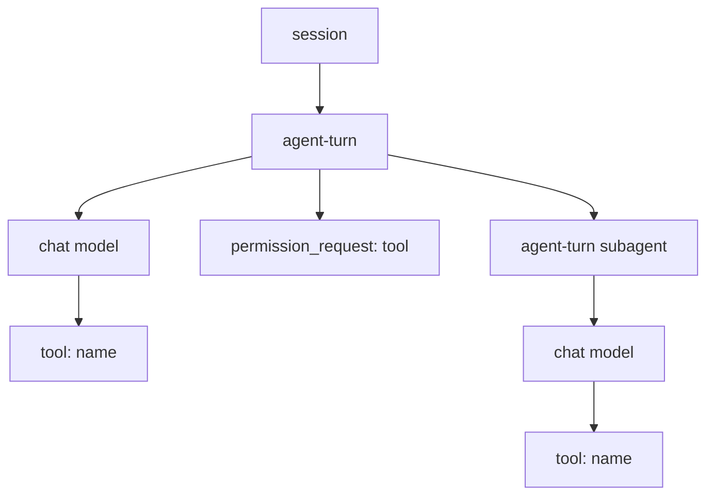

thirdeye is local-first, but it can optionally mirror each captured Claude Code, Codex, or Cursor session to [Pydantic Logfire](https://pydantic.dev/logfire). Export is live once enabled; there is no separate batch-export step.

## Enable export

If you installed thirdeye with Homebrew, Logfire support is already included. Save the gateway key for your project:

```bash
thirdeye logfire enable --token pylf_v1_...
thirdeye logfire status
```

For a Python installation, install the optional dependency first:

```bash
pip install 'thrdi[logfire]'
thirdeye logfire enable --token pylf_v1_...
thirdeye logfire status
```

You can also enable it from **Settings** in `thirdeye ui`. Both paths persist the same settings in `~/.thirdeye/config.yaml`. The gateway key selects the Logfire destination.

To stop exporting while keeping the saved key:

```bash
thirdeye logfire disable
```

## Trace shape

Each thirdeye session becomes one Logfire trace, searchable by `gen_ai.conversation.id` and separated by `claude`, `codex`, or `cursor` service name.



- `session` is a stable root shared by turns exported from separate hook processes.
- `agent-turn` spans carry the user prompt, final response, turn status, and real timestamps.
- `chat <model>` spans carry OpenTelemetry GenAI message, provider, model, and token-usage attributes.
- Tool spans nest under the specific model call that requested them, with paired start/end times.
- Permission requests sit directly under their turn as point-in-time spans.
- Subagent turns nest recursively and preserve their own model and tool-call trees.

Claude Code can produce multiple model-call spans within one turn. Codex reconstructs its model calls and tool children from the completed rollout, deduplicating cumulative token reports before calculating usage. Cursor reconstructs generations from IDE or CLI hooks, pairing shell and MCP callbacks while recording file operations, generic tools, and completed subagents.

## Runtime behavior

The hook never waits for Logfire. It writes a small local job and starts a detached worker, which builds and flushes the span tree in the background. A slow or unreachable endpoint therefore does not add network latency to agent tool calls.

Each turn is claimed atomically so duplicate or replayed hooks do not export the same tree twice. Failed exports release the claim so a later retry can recover. Logfire errors are written to thirdeye's capture error log and are never emitted as hook output.

## Privacy and scrubbing

Enabling Logfire sends captured prompts, responses, tool inputs/results, and span attributes to the Logfire project the gateway key belongs to. Leave it disabled if traces must remain exclusively local.

Logfire's default secret scrubbing remains active. thirdeye exempts only the default match for the literal word `session`, because that word commonly appears in legitimate agent content and paths.

## Troubleshooting

- **`package installed : False`.** Python installs need `pip install 'thrdi[logfire]'` in the same environment that provides `thirdeye`. Homebrew installs already include it.
- **`active : False`.** Export is active only when the package is installed, export is enabled, and a token is saved.
- **A turn does not appear immediately.** Export begins after a turn is completed or interrupted, and the detached worker may take a moment to flush.
- **Export failures.** Run `thirdeye usage errors` to inspect the capture audit log without exposing failures to the agent hook.
